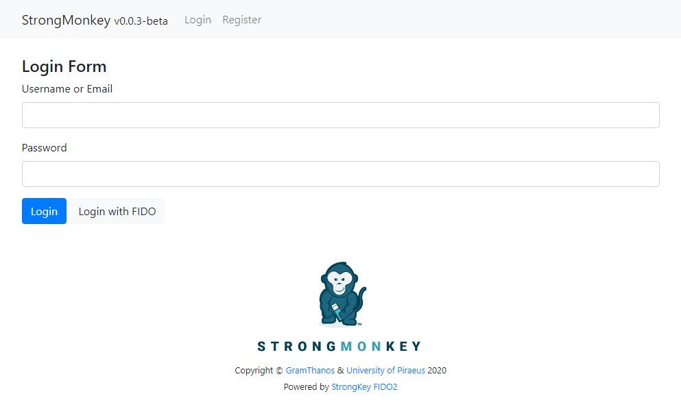
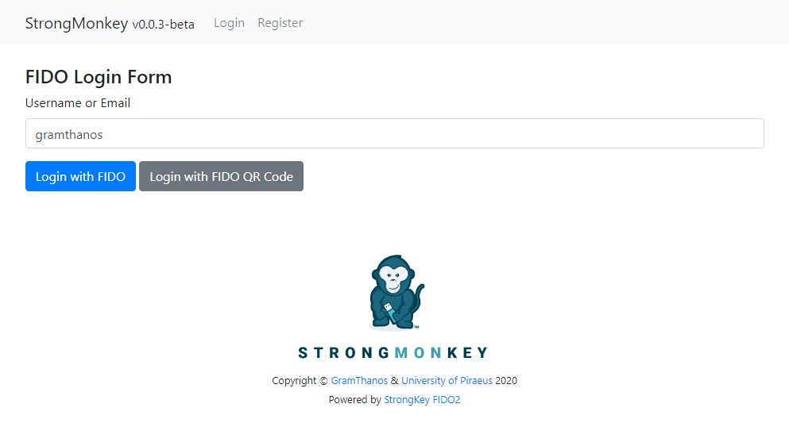
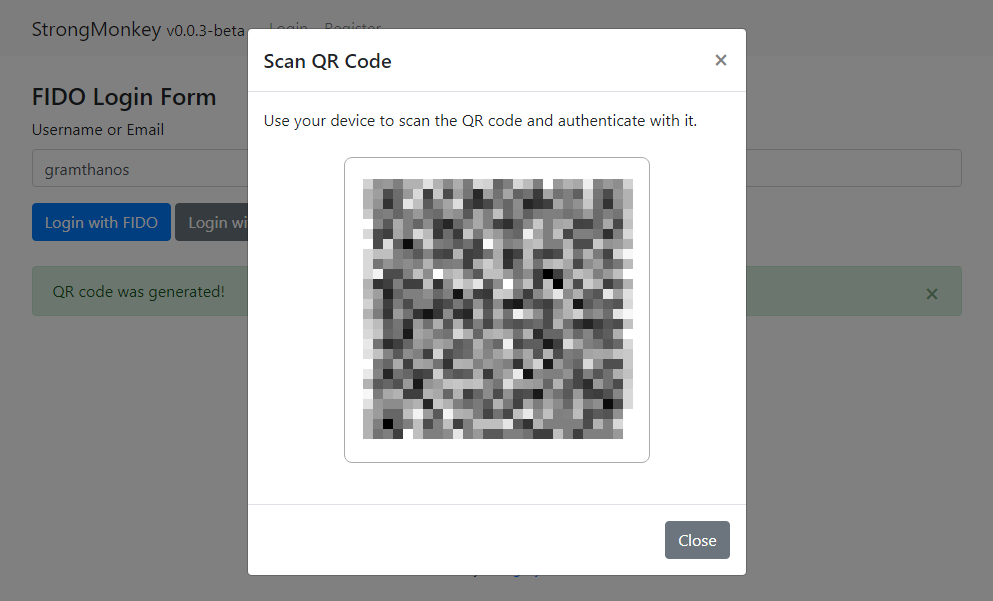
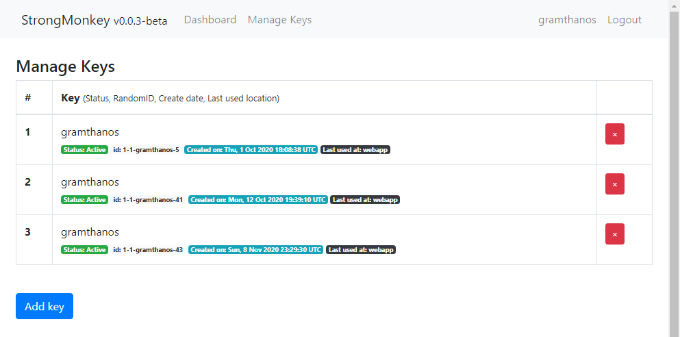

<!--
-->

# StrongMonkey

A PHP & Python library for interacting with the [StrongKey FIDO2](https://github.com/StrongKey/fido2) Server


*The strong monkey that handles USB tokens given by the strong octopus*

• [StrongMonkey PHP library file](StrongMonkey.php) • [StrongMonkey Python library file](StrongMonkey.py) • [StrongMonkey API Documentation](docs/library_api.md) • [Example Application Setup Guide](docs/setup_guide.md) •

---
## Example usage

Download the [StrongMonkey](StrongMonkey.php) PHP library and make a simple PING request to your StrongKey FIDO2 server.

```php
// Don't validate SSL certificate
define('STRONGMONKEY_DEBUG', true);
// Include the library
include('StrongMonkey.php');
// Specify the FIDO server's URL and the authentication method to be used
$monkey = new StrongMonkey('https://localhost:8181', 1, 'REST', 'HMAC', '162a5684336fa6e7', '7edd81de1baab6ebcc76ebe3e38f41f4');
// Send a ping request to the server
$result = $monkey->ping();
// If there is an error print it
if ($error = $monkey->getError($result)) {
	die($error . "\n");
}
// Print server info
die($result);
```

You can also do the same thing using the [StrongMonkey](StrongMonkey.py) Python library.

```python
# Include Library
import StrongMonkey
# Don't validate SSL certificate
StrongMonkey.STRONGMONKEY_DEBUG = True
# Specify the FIDO server's URL and the authentication method to be used
monkey = StrongMonkey.StrongMonkey('https://localhost:8181', 1, 'REST', 'HMAC', '162a5684336fa6e7', '7edd81de1baab6ebcc76ebe3e38f41f4')
# Send a ping request to the server
result = monkey.ping()
# If there is an error print it
error = monkey.getError(result)
if (error):
    print(error)
else:
	# Print server info
	print(result)
```

---
## Example App Preview
Normal login page


FIDO2 login page


FIDO2 login using registered mobile devices


Page to manage and register keys



---
## About
This library was developed by [GramThanos](https://www.linkedin.com/in/gramthanos/) in collaboration with the [Systems Security Laboratory](https://ssl.ds.unipi.gr/) at Department of Digital Systems at [University of Piraeus](https://www.unipi.gr/).

---
## License
This project is under The GNU LGPLv2.1 license.

Copyright (c) 2020 Grammatopoulos Athanasios-Vasileios
