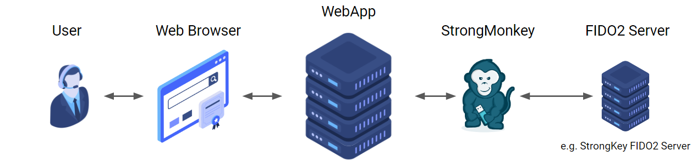

<!--
-->

# StrongMonkey

SDK for interacting with FIDO2 Server API v3.0.0

• [PHP SDK](php/README.md) • [Python SDK](python/README.md) •

---

Supported Languages: 
 - [PHP](php/README.md)
 - [Python](python/README.md)

Compatible Servers:
 - [StrongKey FIDO2](https://github.com/StrongKey/fido2)

Demo Relying Party Application:
 - [PHP Demo FIDO2/WebAuthn App](php/DEMO-APP.md)

---

## Understanding FIDO2/WebAuthn

---

## About

This project was developed by [GramThanos](https://www.linkedin.com/in/gramthanos/) in collaboration with the [Systems Security Laboratory](https://ssl.ds.unipi.gr/) at Department of Digital Systems at [University of Piraeus](https://www.unipi.gr/).

---

## License

This project is under The GNU LGPLv2.1 license.

Copyright (c) 2020-2021 Grammatopoulos Athanasios-Vasileios
