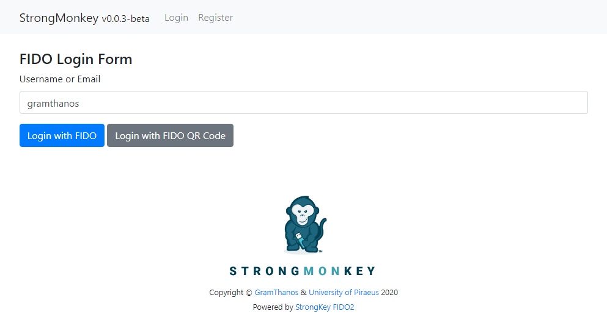

# DEMO FIDO2/WebAuthn App

Demo application with FIDO Login using StrongMonkey PHP SDK

---
# Example App Preview
Normal login page


FIDO2 login page


FIDO2 login using registered mobile devices


Page to manage and register keys


---
# Setup example application

## Prepare WebServer and SQL server
To run the example application you will need:
- a web server with PHP support (to host and run the PHP code)
- a SQL server (to store the application users)
- a domain name with an SSL certificate

On our tests we used Apache/2.4.29, PHP 7.2.24 and MariaDB 10.1.44.

From this point on, we will assume that the example application's code is accessible from your web server and can be served through HTTPS to a modern browser.

Note: For testing, you can use a custom self signed certificate and manually edit your platform's hosts file to bind a domain to your web server's IP.

## Prepare FIDO2 server
As you suspected, you should have a working StrongKey FIDO2 server. If you don't have one ready, you can deploy one following the official guide [here](https://github.com/StrongKey/fido2/blob/master/docs/Installation_Guide_Linux.md).

You should now have:
- A URL of your FIDO2 server
- Credentials to authenticate with the FIDO2 server
    - Username & Password Credentials (PASSWORD method) or
        - Default username `svcfidouser` & default password `Abcd1234!`
    - Public ID & secret key Credentials (HMAC method)
        - Default public ID `162a5684336fa6e7` & default secret key `7edd81de1baab6ebcc76ebe3e38f41f4`

Note: Passwords credentials can be created by creating new users on the LDAP server that the FIDO2 server is communicating with while HMAC credentials can be created through the `keymanager.jar` tool.
```sh
cd /usr/local/strongkey/keymanager
java -jar keymanager.jar addaccesskey /usr/local/strongkey/skfs/keystores/signingkeystore.bcfks Abcd1234!
```

You may also use the example ping snippet to test if the library can communicate correctly with the StrongKey FIDO2 server.

## Configure application
You can find the configuration of the application at `example-app/includes/config.php`.

### Configure FIDO2
You should edit the configuration and insert the FIDO2 server's information and your authentication credentials.

```php
// StrongKey FIDO info
define('APP_FIDO_URL', 'https://192.168.64.128:8181');             // URL of the FIDO2 server (domain name or IP address and port)
define('APP_FIDO_DID', 1);                                         // Domain ID to user (you may leave it 1)
define('APP_FIDO_PROTOCOL', 'REST');                               // Protocol to be used (only REST is supported)

// Example authentication using HMAC
define('APP_FIDO_AUTH', 'HMAC');                                   // Authenticate with FIDO2 server using HMAC signatures
define('APP_FIDO_KEYID', '162a5684336fa6e7');                      // Public ID credentials to be used for authentication
define('APP_FIDO_KEYSECRET', '7edd81de1baab6ebcc76ebe3e38f41f4');  // Secret Key to be used for authentication (HMAC key)

// Example authentication using PASSWORD (do not use it over HTTP)
//define('APP_FIDO_AUTH', 'PASSWORD');                             // Authenticate with FIDO2 server using HMAC signatures
//define('APP_FIDO_KEYID', 'svcfidouser');                         // Username to be used for authentication
//define('APP_FIDO_KEYSECRET', 'Abcd1234!');                       // Password to be used for authentication
```

### Configure SQL Database
The example application communicates with an SQL server to save the created users. You can manually setup the SQL database or configure and run a setup PHP script.

#### Setup Script

Edit the `example-app/setup_delete_me.php` script to add the credentials and the host name of the SQL server to setup.
```php
// Change these credentials for your database
define('ADMIN_DATABASE_USER', 'admin');            // SQL admin username
define('ADMIN_DATABASE_PASSWORD', '123!@#qweQWE'); // SQL admin password
```

Then edit the `example-app/includes/config.php` to set the database name to be created and the user to be created for that database
```php
// Database
define('APP_DATABASE_HOST', 'localhost');           // Host of the SQL server
define('APP_DATABASE_USER', 'app_user');            // Username of the user to be created for this database
define('APP_DATABASE_PASSWORD', 'app_user_pass');   // Password of the user to be created for this database
define('APP_DATABASE_NAME', 'strongmonkey_app_db'); // Database to be created of this application
```

Then run the `example-app/setup_delete_me.php` either by visiting its corresponding URL or by executing it from the terminal (e.g. `php example-app/setup_delete_me.php`).

#### Manual Setup

Edit the `example-app/includes/config.php` to set the SQL server host, the name of the database to be used and the user's credentials to be used to access the database. 
```php
// Database
define('APP_DATABASE_HOST', 'localhost');           // Host of the SQL server
define('APP_DATABASE_USER', 'app_user');            // Username of the user with access to the database
define('APP_DATABASE_PASSWORD', 'app_user_pass');   // Password of the user with access to the database 
define('APP_DATABASE_NAME', 'strongmonkey_app_db'); // Database to be used
```

Then, login to your SQL server and the database as configured earlier and create the `users` table by executing the following SQL statement.
```SQL
CREATE TABLE IF NOT EXISTS `users` (
    `id` int NOT NULL AUTO_INCREMENT,
    `username` varchar(32) NOT NULL,
    `email` varchar(255) NOT NULL,
    `password_hash` varchar(255) NOT NULL,
    PRIMARY KEY (`id`)
) DEFAULT CHARSET=utf8;
```

## Use the application

You are now ready to test the example application.
1. Go to the register page and create a test user
2. Login to the application
3. Go to the key manage page
4. Add an authenticator
5. Logout
6. Try to login with FIDO
